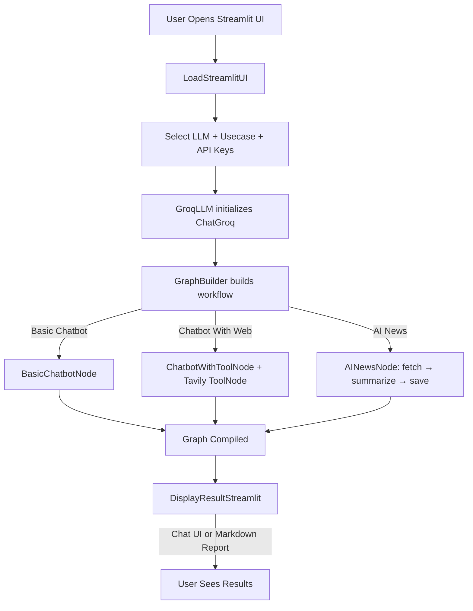

### End to End Project Agentic AI Chatbots
# LangGraph Agentic AI 🤖

An end-to-end **Streamlit application** showcasing how to build **stateful agentic AI workflows** with [LangGraph](https://python.langchain.com/docs/langgraph), **Groq-hosted LLMs**, and **Tavily Search API**.

This project demonstrates three powerful use cases:

1. **Basic Chatbot** – simple conversation agent.
2. **Chatbot With Web** – enhanced with Tavily search tools.
3. **AI News Explorer** – fetches, summarizes, and stores AI-related news.

---

## 🚀 Features

* Graph-based orchestration (`StateGraph`) for modular agent design.
* Groq LLM integration via `ChatGroq`.
* Tool support (Tavily search API).
* AI News Explorer:

  * Fetch top AI news (India + Global).
  * Summarize into markdown with sources.
  * Save reports in `./AINews/`.
* Streamlit UI with sidebar controls (LLM, models, use case, API keys).

---

## 🛠️ Tech Stack

* **Python 3.9+**
* **Streamlit** – web UI
* **LangGraph** – stateful graph orchestration
* **LangChain** – LLM + tool integration
* **Groq API** – hosted large language models
* **Tavily API** – news & search integration

---

## ⚙️ Setup

### 1. Clone repository

```bash
git clone https://github.com/KartikNimhan/Agentic_Chatbot.git
cd langgraph-agentic-ai
```

### 2. Install dependencies

```bash
pip install -r requirements.txt
```

### 3. API Keys

You need:

* **Groq API Key** → [Groq Console](https://console.groq.com/keys)
* **Tavily API Key** → [Tavily](https://app.tavily.com/home)

👉 Both keys are entered directly in the **Streamlit sidebar** when the app runs.

---

## 🎮 Run the Application

```bash
streamlit run app.py
```

The app will launch at 👉 [http://localhost:8501](http://localhost:8501)

---

## 📂 Project Structure

```
.
│   app.py                # Streamlit entrypoint
│   main.py               # Loads the app
│   requirements.txt      
│   README.md
│
├───AINews                # Generated AI News summaries
│       daily_summary.md
│       weekly_summary.md
│       monthly_summary.md
│
└───src/langgraphagenticai
    ├───graph
    │       graph_builder.py       # Builds LangGraph workflows
    │
    ├───LLMS
    │       groqllm.py             # Groq LLM wrapper
    │
    ├───nodes
    │       basic_chatbot_node.py  # Basic chatbot logic
    │       chatbot_with_Tool_node.py # Chatbot with tool integration
    │       ai_news_node.py        # AI News fetch + summarize + save
    │
    ├───state
    │       state.py               # Shared state (messages)
    │
    ├───tools
    │       search_tool.py         # Tavily search integration
    │
    ├───ui
    │       uiconfigfile.ini       # UI configuration
    │       uiconfigfile.py        # Loads config
    │
    │   └───streamlitui
    │           loadui.py          # Sidebar input UI
    │           display_result.py  # Displays chatbot/news results
    │
    └───main.py                    # App loader
```

---

## 🔄 Flow of Execution



---

## 📌 Future Improvements

* Support multiple LLM providers (Anthropic, OpenAI).
* Extend AI News beyond AI domain.
* Add long-term memory for multi-turn chats.
* Dockerize for easy deployment.

---

✨ This project is a solid foundation for experimenting with **stateful agentic AI systems** using LangGraph + Groq.

---
